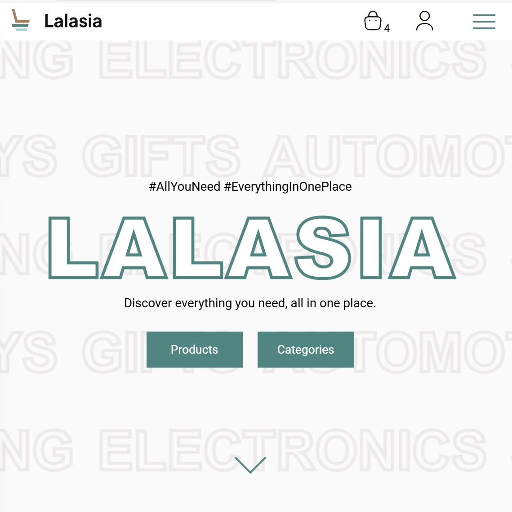
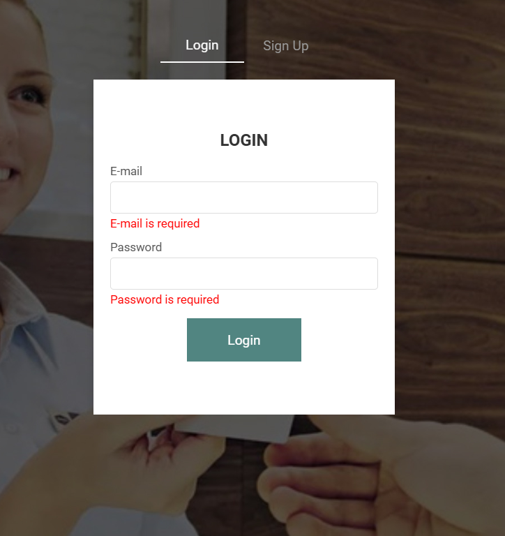
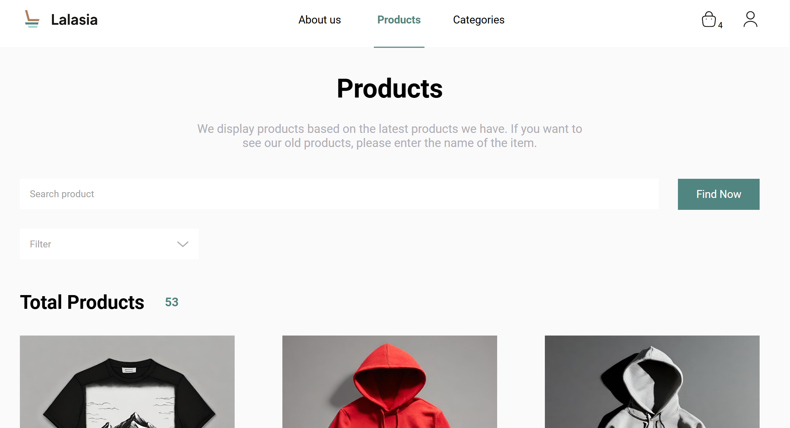
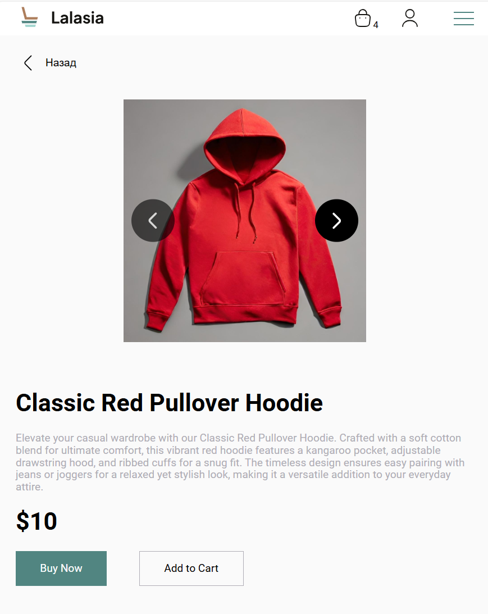
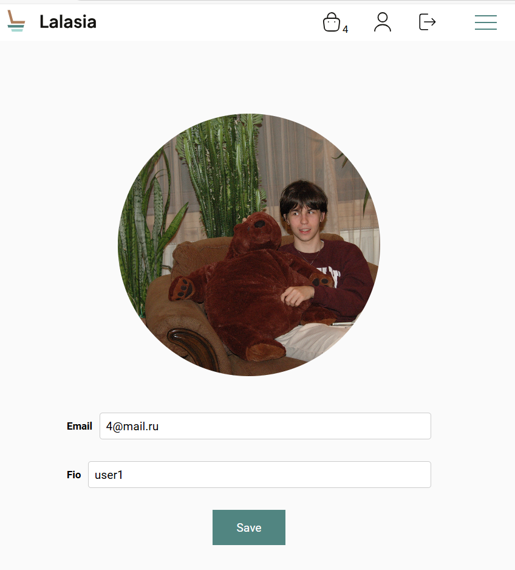
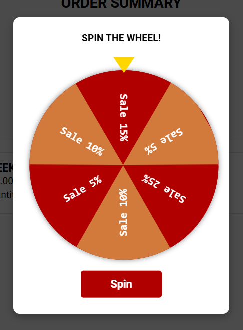
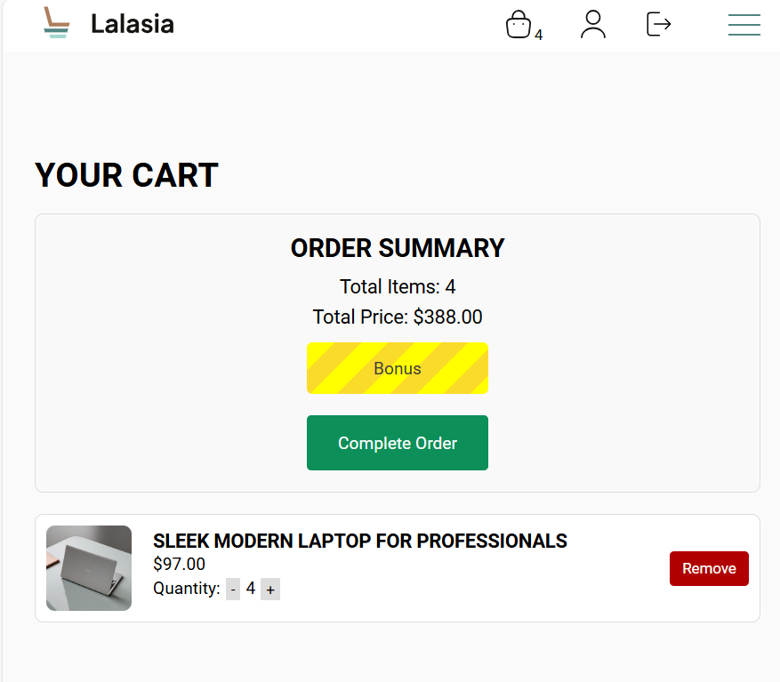
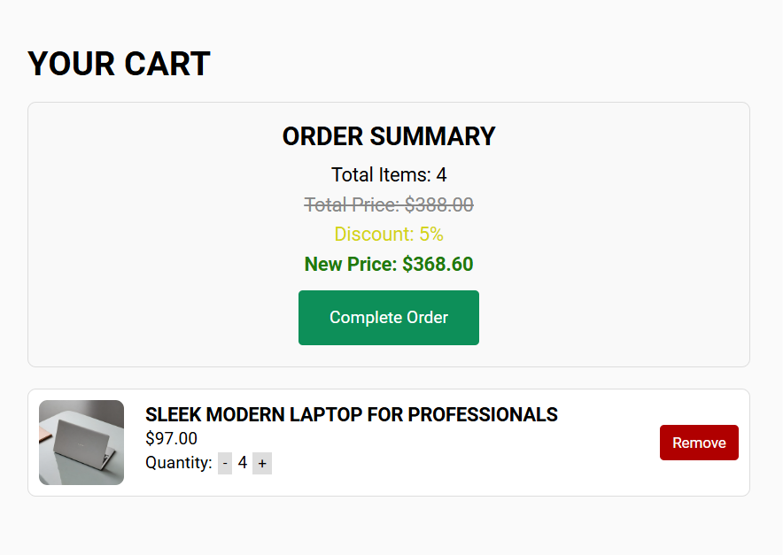
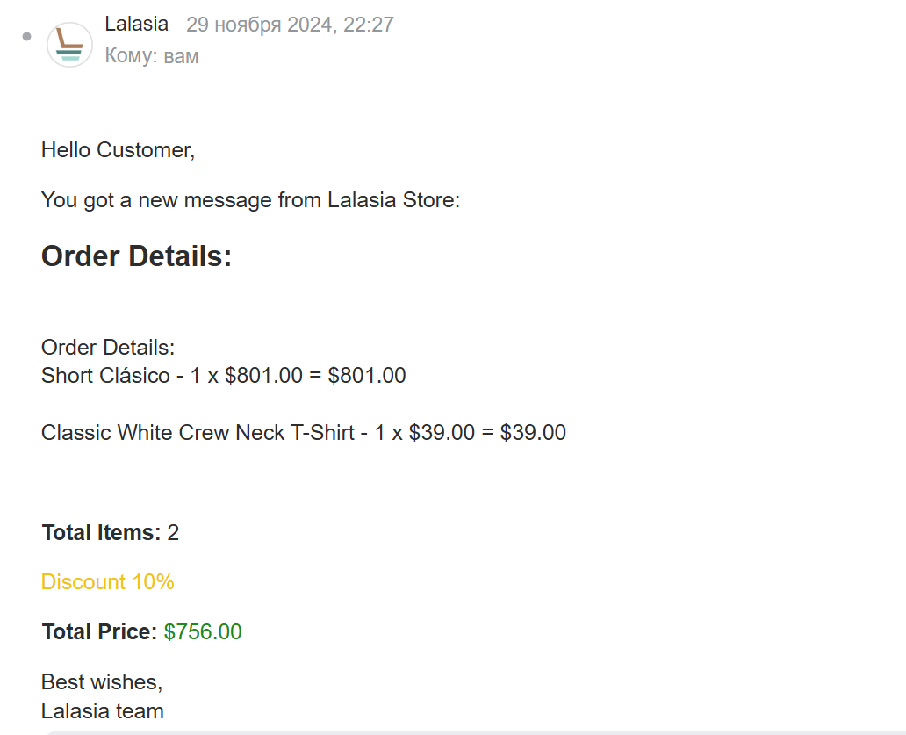
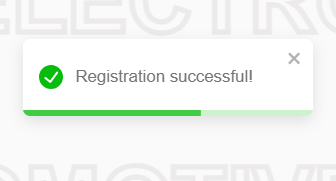

# 🛒 E-commerce Web App

Современное e-commerce веб-приложение, разработанное с использованием **React**, **MobX**, **Vite/Webpack**, **CSS Modules** и других инструментов. Поддерживает адаптивный интерфейс, офлайн-доступ через PWA и интерактивный функционал, включая бонусную механику при заказе.

## 🔗 Приложение

👉 [Открыть демо](https://sushakkk.github.io/E-commerce)

## 🔧 Стек технологий

- **Frontend:** React, MobX, React Router
- **Сборка:** Vite → Webpack + Babel
- **Стилизация:** CSS Modules
- **Хранилище:** MobX stores
- **Интеграции:** Email.js
- **PWA:** Установка как приложение
- **Кроссбраузерность:** BrowserStack

## 🚀 Возможности

- Адаптивный дизайн
- Авторизация и регистрация
- Личный кабинет с редактированием профиля
- Работа с корзиной и локальным хранилищем
- Управление товарами: фильтрация, поиск, пагинация
- Система бонусов и скидок при покупке
- Email-уведомление о заказе
- Интеграция с API

## 🏗️ Структура MobX-сторов

- **AuthStore** – управление данными пользователя, авторизация
- **BasketStore** – корзина с синхронизацией с LocalStorage
- **ProductsStore** – загрузка и обновление товаров
- **ProductDetailsStore** – детали конкретного товара
- **FilterStore** – фильтрация и сортировка
- **QueryStore** – управление URL-параметрами

## 📸 Скриншоты

### 🏠 Главная страница

<br/>

<hr/>

### 🔐 Авторизация

<hr/>

### 🛍️ Список товаров

<hr/>

### 🧾 Детальная карточка товара

<hr/>

### 👤 Личный кабинет

<hr/>

### 🎁 Бонусная механика

<br/>

<br/>

<br/>

<hr/>

### 📧 Email-уведомление

<hr/>

### 📘 Уведомления

<hr/>

## 📦 Установка

```bash
git clone https://github.com/Sushakkk/E-commerce.git
cd E-commerce
yarn install
yarn dev
````

## 🧪 Сборка продакшена

```bash
yarn build
```
